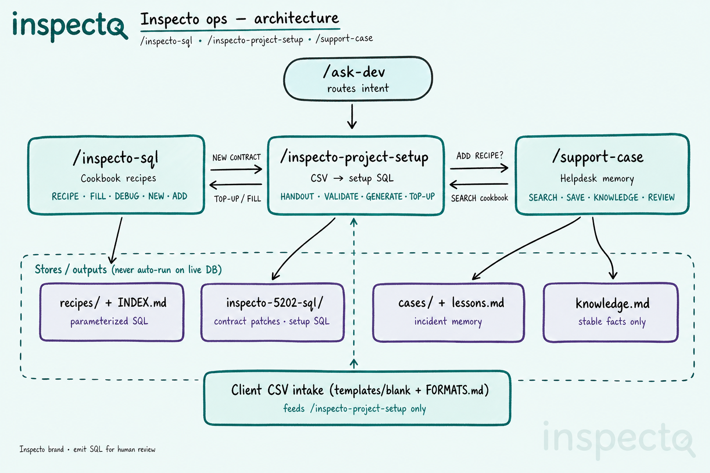
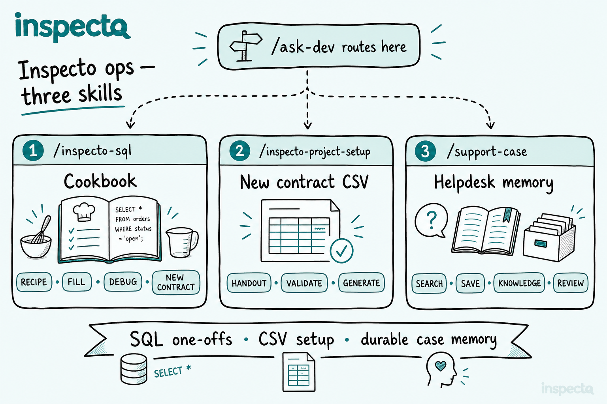
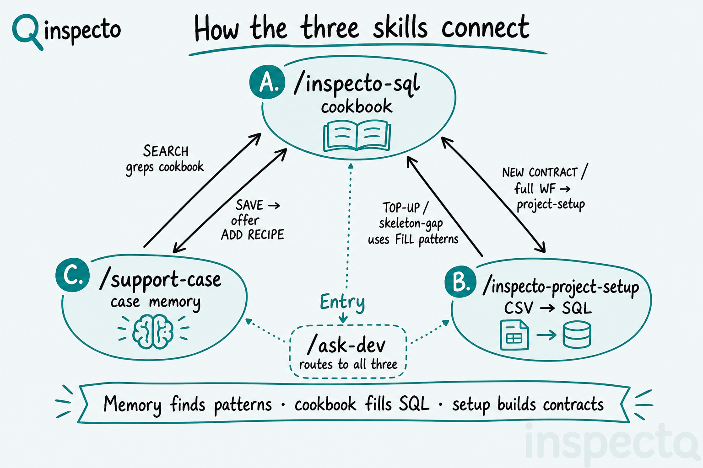
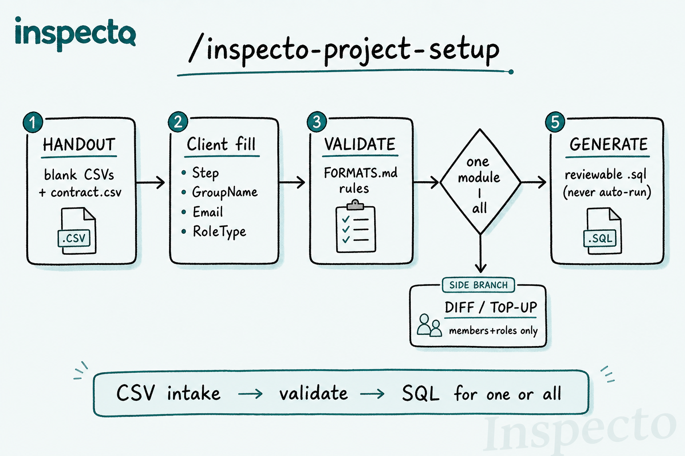
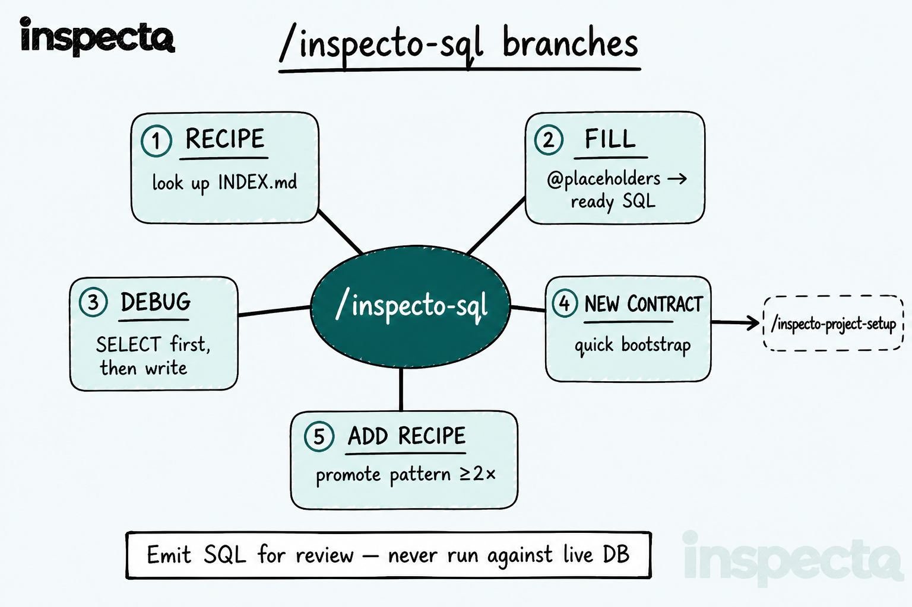
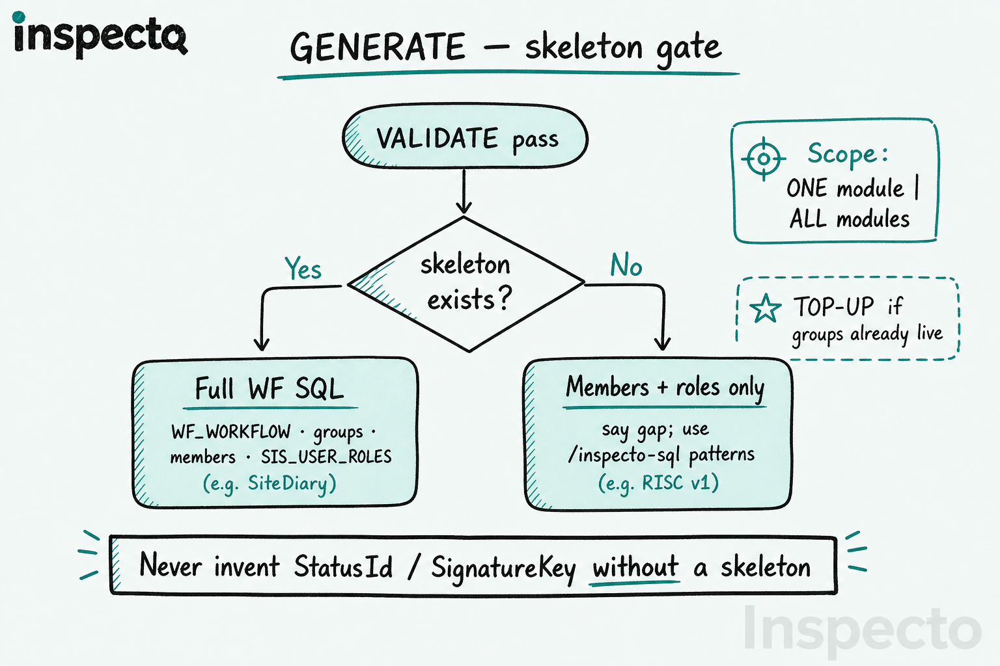
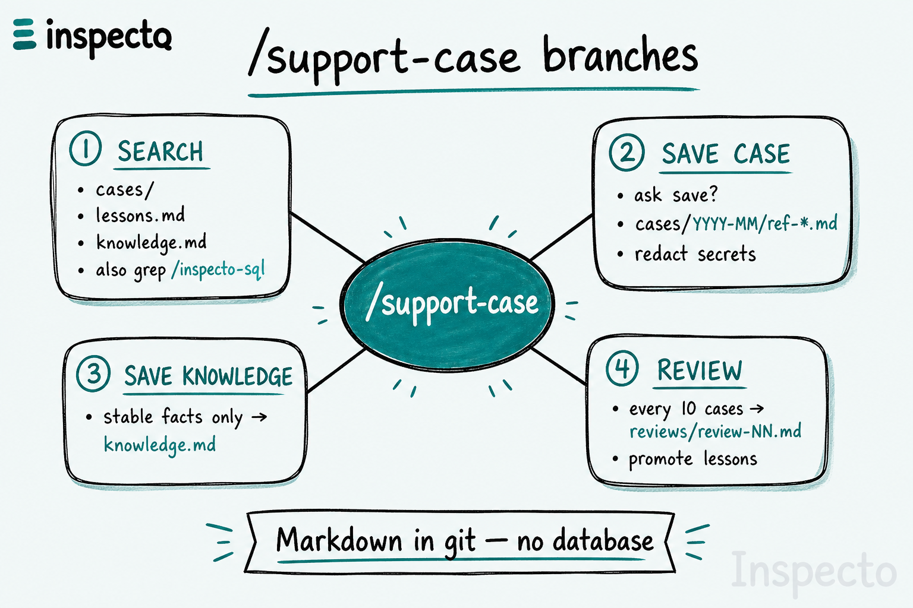
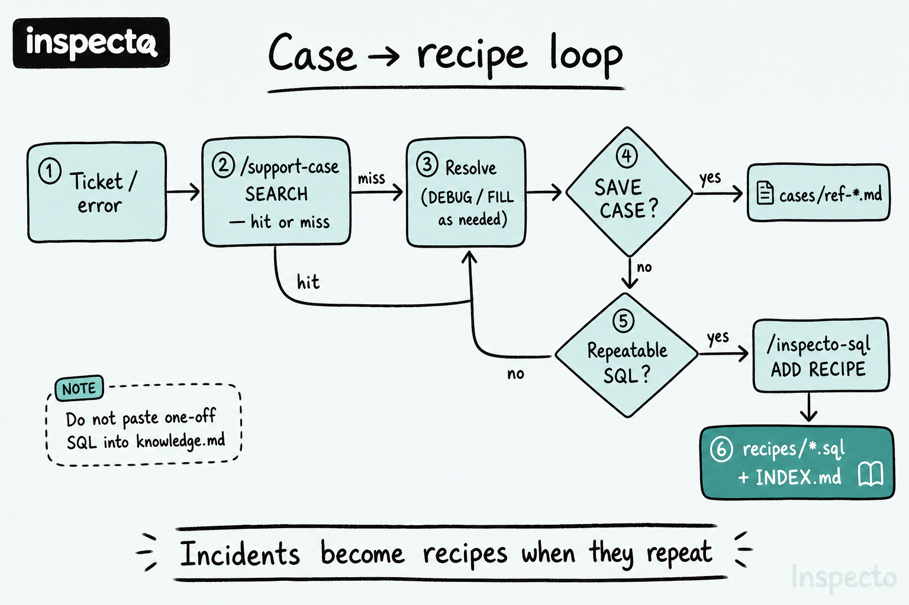

# Inspecto ops trio — how it works

Day-to-day SQL, new-contract CSV setup, and helpdesk memory — three skills, clear hand-offs.

Diagrams (SVG): [diagram/](./diagram/) · Inspecto brand + logo watermark.

| Skill | Use when |
|-------|----------|
| **`/inspecto-sql`** | One-off grant role, add group member, unlock, debug access, quick bootstrap, promote a recipe |
| **`/inspecto-project-setup`** | New contract: hand out CSVs, validate, generate setup SQL for **one module or all** |
| **`/support-case`** | Search/save helpdesk cases; promote lessons; grep the SQL cookbook on access issues |

---

## New project flow (`/inspecto-project-setup`)

1. **HANDOUT** — blank CSVs per form (`Safety`, `SiteDiary`, `RISC`, …) + `contract.csv`
2. Client fills **Step / GroupName / Email / RoleType** (RISC follows inspection approval steps 1→5→6.1|6.2→7)
3. **VALIDATE** — required fields, trailing spaces, known modules
4. **GENERATE** — ask **one module** or **all** → reviewable `.sql` (never auto-run on DB)

---

## Day-to-day SQL cookbook (`/inspecto-sql`)

- **RECIPE** — look up template in `INDEX.md`
- **FILL** — placeholders → ready SQL
- **DEBUG** — read-only SELECTs first
- **NEW CONTRACT** — quick bootstrap, or hand off to project-setup for CSV/full WF
- **ADD RECIPE** — promote a repeatable pattern (≥2×)

---

## GENERATE: full WF vs members only

- **Skeleton exists** (e.g. SiteDiary) → full `WF_WORKFLOW` + groups + members + roles
- **No skeleton** (e.g. RISC v1) → members + `SIS_USER_ROLES` only; say the gap
- **TOP-UP** — groups already live → members/roles only via `/inspecto-sql` patterns

---

## Support memory (`/support-case`)

- **SEARCH** — `cases/` · `lessons.md` · `knowledge.md` · also grep `/inspecto-sql` when access/SQL related
- **SAVE CASE** — ask first → `cases/YYYY-MM/ref-*.md` · redact secrets
- **SAVE KNOWLEDGE** — stable facts only (not ticket narratives)
- **REVIEW** — every 10 cases → `reviews/review-NN.md` · promote lessons

Repeatable ops SQL leaves a case and becomes a cookbook recipe via **ADD RECIPE** — do not paste one-offs into `knowledge.md`.

---

## SVG diagrams

| File | Content |
|------|---------|
| [diagram/01-architecture-ops-trio.svg](diagram/01-architecture-ops-trio.svg) | Three-skill architecture + stores |
| [diagram/02-flowchart-inspecto-sql.svg](diagram/02-flowchart-inspecto-sql.svg) | SQL branches |
| [diagram/03-flowchart-project-setup.svg](diagram/03-flowchart-project-setup.svg) | Project-setup flow |
| [diagram/04-flowchart-support-case.svg](diagram/04-flowchart-support-case.svg) | Support-case branches |

Each SVG includes the Inspecto logo (top-left) and a faint Inspecto watermark (bottom-right).
