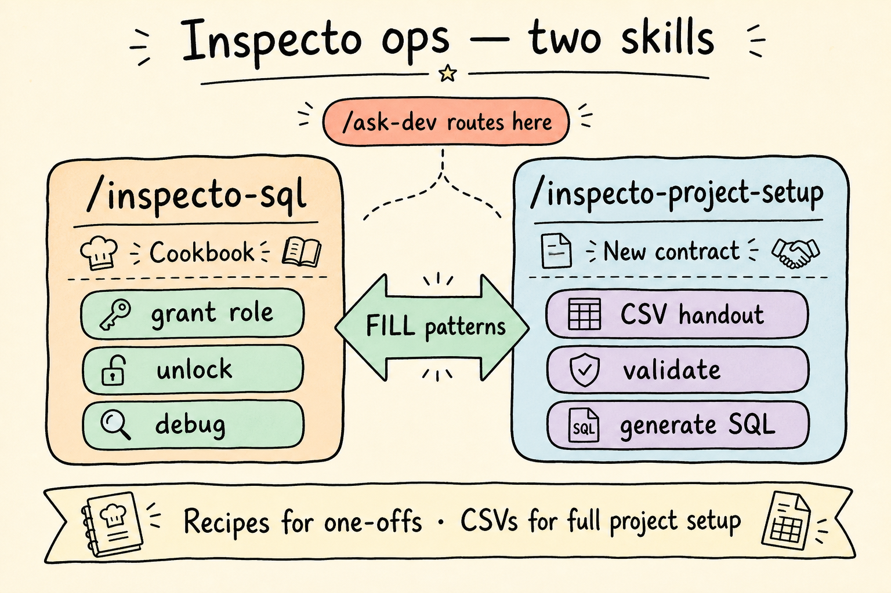

# Inspecto SQL & project setup — how it works

Ops path for new contracts and day-to-day user/role SQL. Two skills, clear split.

| Skill | Use when |
|-------|----------|
| **`/inspecto-sql`** | One-off grant role, add group member, unlock, debug access, quick bootstrap |
| **`/inspecto-project-setup`** | New contract: hand out CSVs, validate, generate setup SQL for **one module or all** |

## New project flow

1. **HANDOUT** — blank CSVs per form (`Safety`, `SiteDiary`, `RISC`, …) + `contract.csv`
2. Client fills **Step / GroupName / Email / RoleType** (RISC follows inspection approval steps 1→5→6.1|6.2→7)
3. **VALIDATE** — required fields, trailing spaces, known modules
4. **GENERATE** — ask **one module** or **all** → reviewable `.sql` (never auto-run on DB)

## Day-to-day SQL cookbook

- **RECIPE** — look up template  
- **FILL** — placeholders → ready SQL  
- **DEBUG** — read-only SELECTs first  
- **NEW CONTRACT** — quick bootstrap, or hand off to project-setup for CSV/full WF  
- **ADD RECIPE** — promote a repeatable pattern  

## GENERATE: full WF vs members only

- **Skeleton exists** (e.g. SiteDiary) → full `WF_WORKFLOW` + groups + members + roles  
- **No skeleton** (e.g. RISC v1) → members + `SIS_USER_ROLES` only; say the gap  
- **TOP-UP** — groups already live → members/roles only via `/inspecto-sql` patterns  
