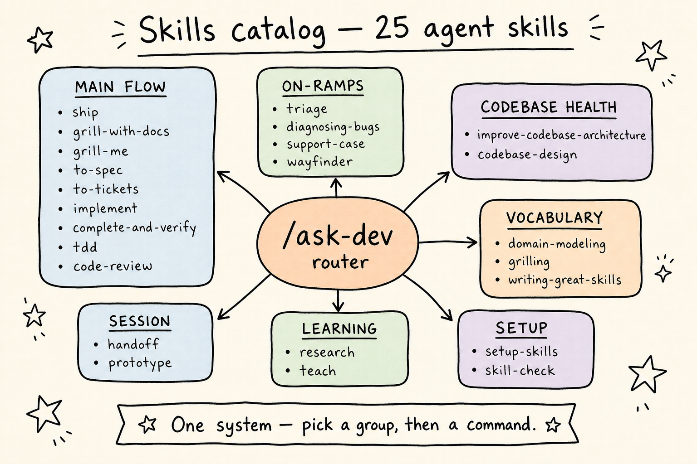
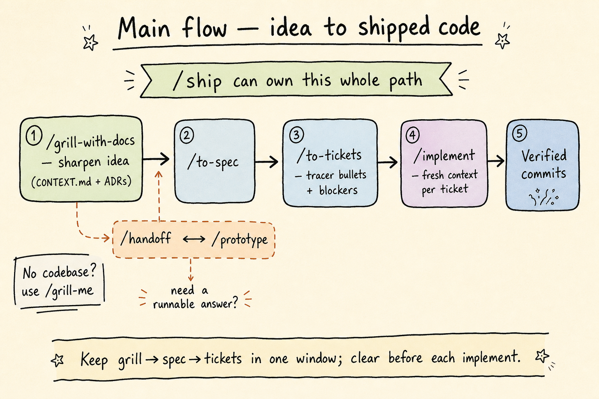
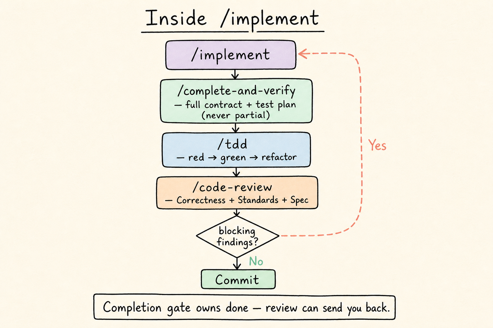
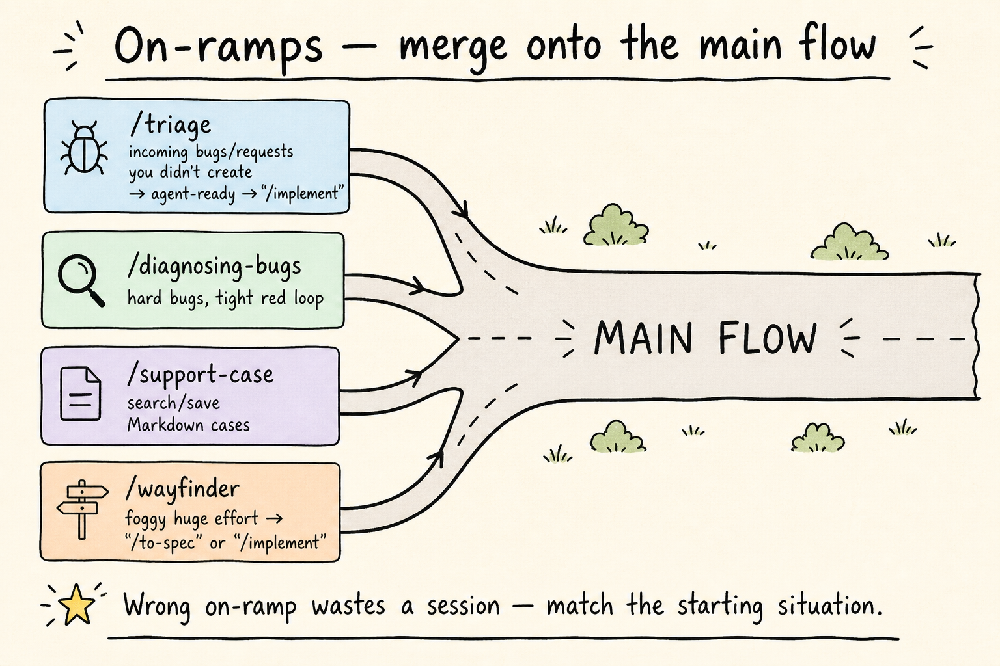
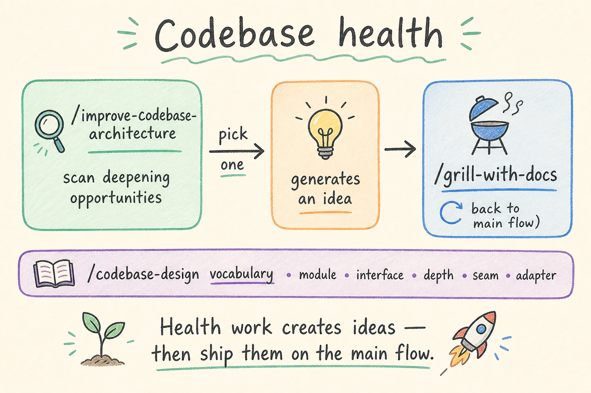
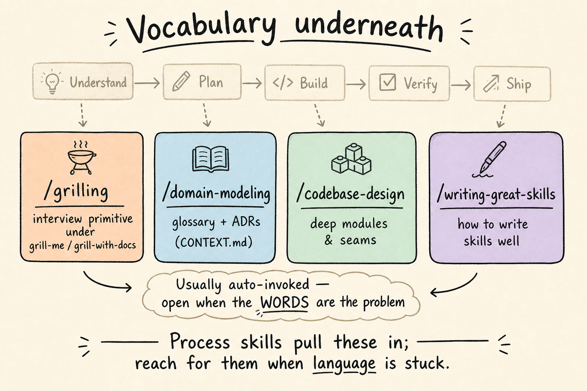
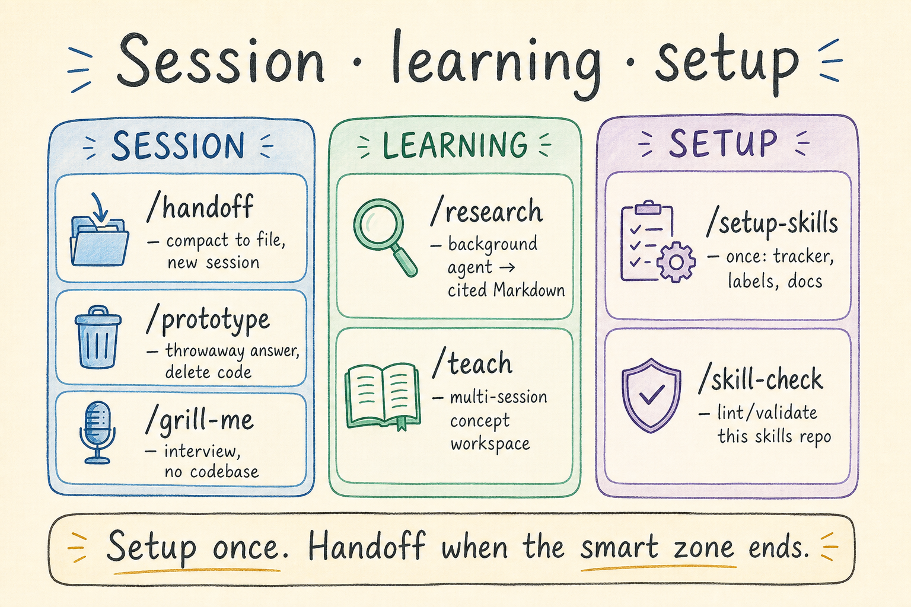
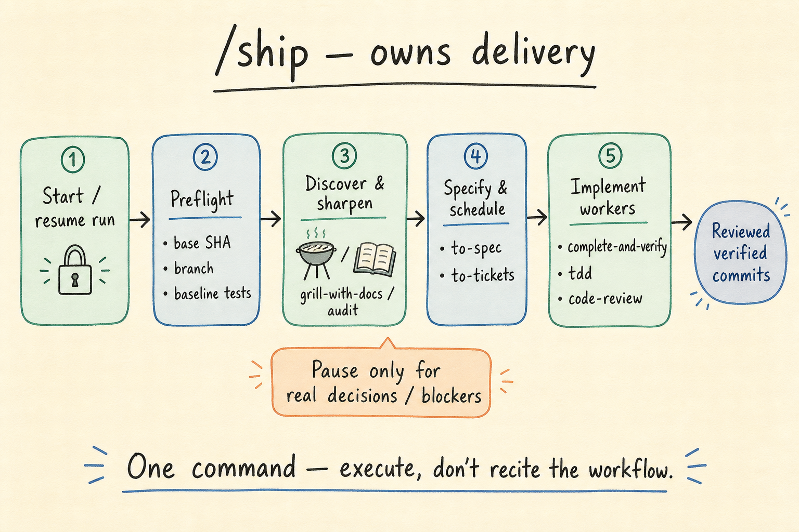
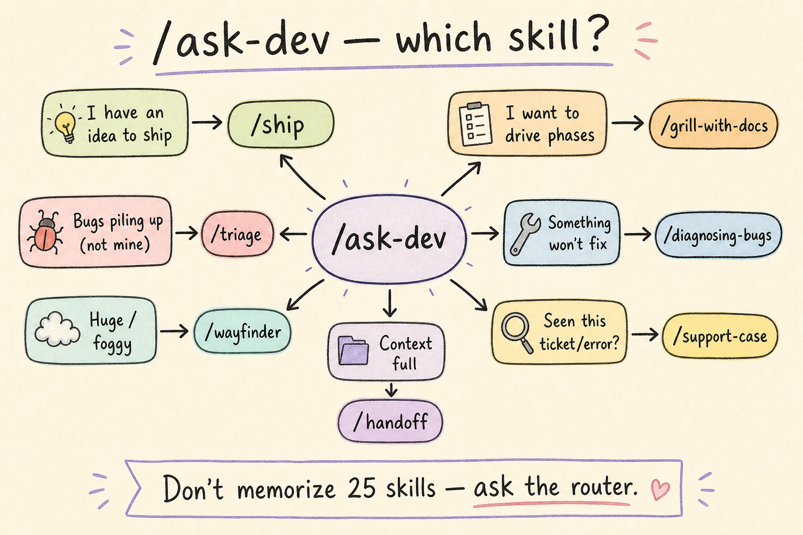

# Skills system — how it works (all 25)

Visual guide to the engineering skills in this collection. Commands use `/skill-name`.

**Per-skill cards (25):** see [`skill-cards/README.md`](skill-cards/README.md).

## Catalog map

Every skill sits in a group. Unsure which to use? Start with **`/ask-dev`**.

## Main flow: idea → shipped code

`/grill-with-docs` → `/to-spec` → `/to-tickets` → `/implement` → verified commits.  
Or let **`/ship`** own the whole path.

## Inside `/implement`

`/complete-and-verify` → `/tdd` → `/code-review` (loop until green), then commit.

## On-ramps

| Situation | Skill |
|-----------|--------|
| Incoming issues you didn’t create | `/triage` |
| Hard / flaky bug | `/diagnosing-bugs` |
| Ticket / error recall | `/support-case` |
| Huge foggy effort | `/wayfinder` |

## Codebase health

`/improve-codebase-architecture` finds deepening work; that becomes an idea for `/grill-with-docs`. `/codebase-design` supplies the vocabulary.

## Vocabulary underneath

Usually auto-invoked: `/grilling`, `/domain-modeling`, `/codebase-design`, plus `/writing-great-skills` as reference.

## Session · learning · setup

## `/ship` owns delivery

One command from idea/audit/ticket to reviewed, verified commits.

## `/ask-dev` router

