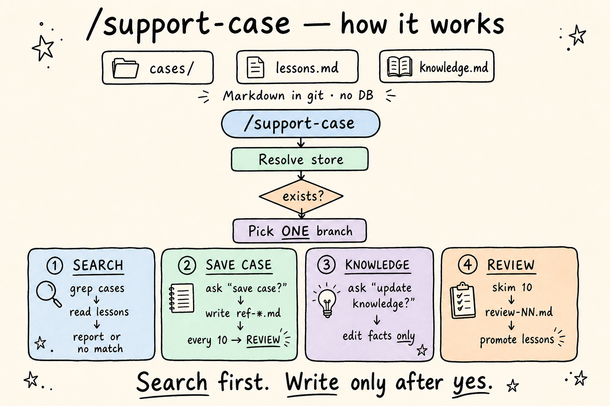
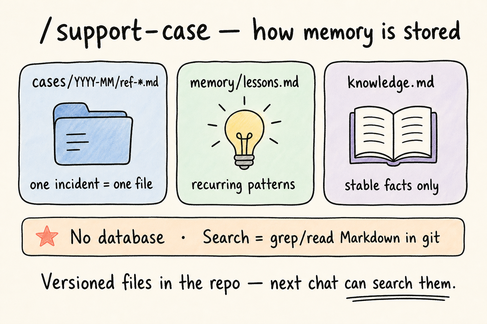
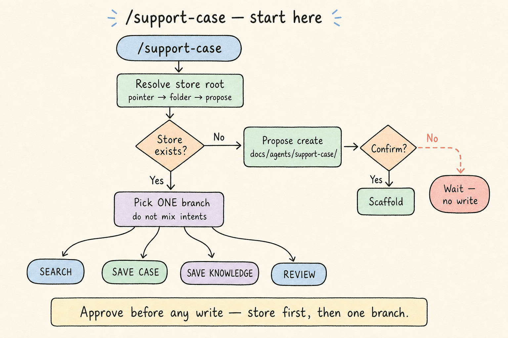
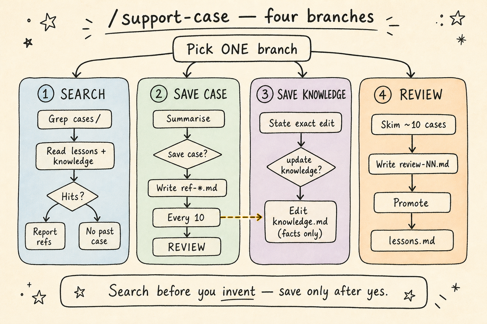
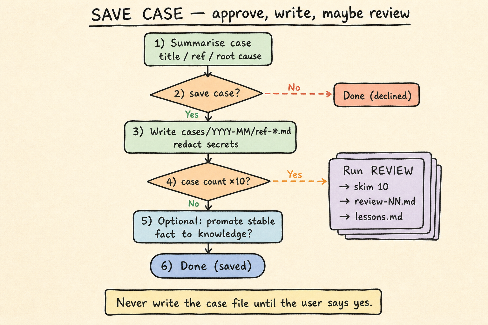

# /support-case — how it works & the flow

Durable helpdesk **recall** as versioned Markdown in git. No database. Search = grep/read.

## How memory is stored

Three stores, different jobs:

| Store | Content |
|-------|---------|
| `cases/YYYY-MM/ref-*.md` | One incident = one file |
| `memory/lessons.md` | Recurring patterns |
| `knowledge.md` | Stable facts only (not ticket stories) |

## Start here: store, then one branch

1. Resolve the store root (pointer → folder → propose create).
2. If missing, ask before scaffolding `docs/agents/support-case/`.
3. Pick **ONE** branch from intent — do not mix search into a save without asking.

## The four branches

- **SEARCH** — grep `cases/`, read lessons + knowledge; report hits or “no past case”
- **SAVE CASE** — ask **save case?** → write `ref-*.md`; every 10 cases → REVIEW
- **SAVE KNOWLEDGE** — ask **update knowledge?** → edit facts only
- **REVIEW** — skim ~10 cases → `review-NN.md` → promote into `lessons.md`

## SAVE CASE deep dive

Never write the case file until the user says **yes**.
